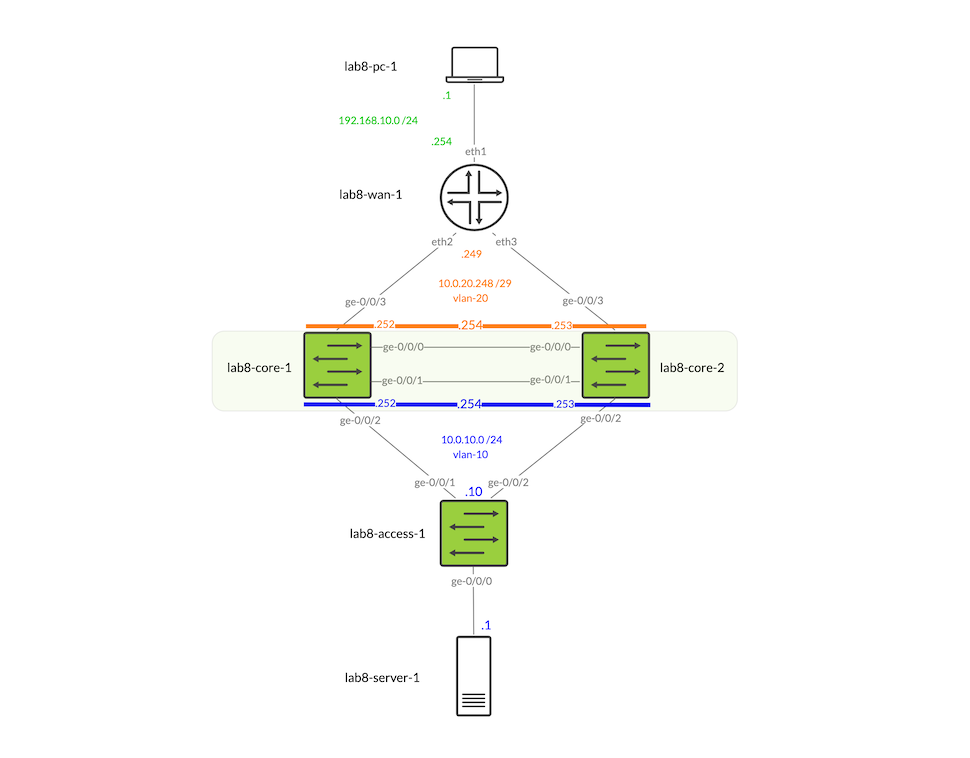

<!-- BEGIN_TF_DOCS -->
# Campus Fabric Multihoming Design with Juniper Mist
## Description

The module creates a Multihoming Campus Fabric managed by Juniper Mist. [Example topology](https://github.com/tnonas/terraform-juniper-mist-campus-fabric-multihoming/blob/main/README.md):

Note, that only the green colored devices and blue colored IP configuration are covered by the module's automation. The example provided uses this specific addressing. The black and white devices, i.e., PCs, servers and routers are for illustration purposes only and serve as a potential add-on outside the module's scope.

The module creates all Juniper Mist constructs needed for the fully operational environment – sites, switch templates, port profiles, port assignments, EVPN fabric configuration and topology etc.

## Dependencies

- [Juniper Mist account](https://manage.mist.com/signin.html#!signup/register) and an associated Organization ID
- Claimed [Juniper EX or QFX switches](https://www.juniper.net/documentation/us/en/software/mist/content/mist-supported-hardware.html#xd_a679a623514d95d6-669993c-186f9d4ff5a--7e07__section_krr_y15_swb) or adopted [vJunos-switch appliances](https://www.juniper.net/us/en/dm/vjunos-labs.html)

## Example

The example deployment was based on vJunos-switch virtual appliances. The specific variables used are provided in module's "example" directory as terraform.tfvars.EXAMPLE file. When copied to the root part of the module (root module) and filename changed to e.g., terraform.tfvars they can be used to configure the provided example topology as illustrated on the diagram.

## Requirements

| Name | Version |
|------|---------|
|  [mist](#requirement\_mist) | 0.4.8 |

## Providers

| Name | Version |
|------|---------|
|  [mist](#provider\_mist) | 0.4.8 |

## Modules

No modules.

## Resources

| Name | Type |
|------|------|
| mist_device_switch.this | resource |
| mist_org_inventory.this | resource |
| mist_org_networktemplate.this | resource |
| mist_org_sitegroup.this | resource |
| mist_site.this | resource |
| mist_site_evpn_topology.this | resource |
| mist_site_networktemplate.this | resource |

## Inputs

| Name | Description | Type | Default | Required |
|------|-------------|------|---------|:--------:|
|  [evpn\_fabric](#input\_evpn\_fabric) | Site level EVPN fabric topology and fabric devices configiurations | <pre>object({     name                   = string     pod_name               = string     bgp_local_as           = string     as_base                = string     subnet                 = string     auto_router_id_subnet  = string     auto_router_id_subnet6 = string     auto_loopback_subnet  = string     auto_loopback_subnet6 = string   })</pre> | n/a | yes |
|  [mist\_cloud](#input\_mist\_cloud) | Target Juniper Mist Cloud API URL | `string` | n/a | yes |
|  [name-prefix](#input\_name-prefix) | A name prefix for resource naming. Please note that some names inside nested variables will have explicit names only. | `string` | n/a | yes |
|  [org\_id](#input\_org\_id) | Target Juniper Mist organization ID for all automation operations | `string` | n/a | yes |
|  [site](#input\_site) | Definition of the sites to be deployed | <pre>object({     name         = string     country_code = string     timezone     = string     address      = string     notes        = string     latlng       = map(number)   })</pre> | n/a | yes |
|  [switch\_root\_password](#input\_switch\_root\_password) | Switches' root password. | `string` | n/a | yes |
|  [switch\_template](#input\_switch\_template) | Org level network templates for switches | <pre>object({     name            = string     networks        = any     port_usages     = any     vrf_config      = any     vrf_instances   = any     switch_matching = any   })</pre> | n/a | yes |
|  [switches](#input\_switches) | Switches added to the site to form EVPN fabric | <pre>map(object({     name             = string     role             = string     mac              = string     port_config      = any     other_ip_configs = any     vrf_instances    = any   }))</pre> | n/a | yes |

## Outputs

No outputs.
<!-- END_TF_DOCS -->    